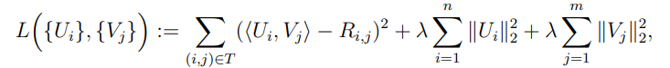

# Personalized movie recommendation system
## Description
- This project is a personalized movie recommendation system that uses, SVD and Alternating Least Squares (ALS) to recommend movies to users based on their ratings.
- more specifically, the goal is to fill in the missing ratings
- There are 1000 users and 5000 movies in the dataset.

## implementation
- We would like to build a atent factor model is the state-of-the-art method for personalized recommendation.
- It learns a vector representation $U_i\in R^d$ and $V_j\in R^d$ for each user $i$ and movie $j$ respectively, such that the inner product of $U_i$ and $V_j$ approximates the rating $R_{i,j}$
- d is the number of latent factors, which we will try different values for.
- The model is evaluated by the following:
- $\text{MSE: } \frac{1}{|S|} \sum_{(i,j) \in S} \left( \langle U_i, V_j \rangle - R_{ij} \right)^2 \quad \text{where } S \text{ is from the test set}$
- $\text{MAE: } \frac{1}{n} \sum_{i=1}^{n} \frac{1}{|N_i|} \sum_{j \in N_i} \left| \langle U_i, V_j \rangle - R_{ij} \right|$
- The first model is non-personalized, which just predicts the average rating for each movie
- The second model is personalized, which predicts unrated movies by applying SVD
- The last model is also personalized, but uses ALS to predict unrated movies instead of SVD.
- The loss function is defined as: 
